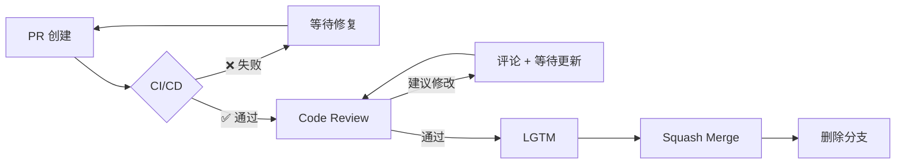

# Pulse GitHub 工作流程配置说明

本文档说明已配置的标准化 Git 工作流程和工具链。

## 📦 已安装的工具和配置

### 1. Git Hooks（Husky）

**位置：** `.husky/`

**功能：**
- `commit-msg` - 验证提交信息符合 Conventional Commits 规范
- `pre-commit` - 在提交前自动运行 lint 检查

**工作原理：**

```bash
git commit
  ↓
commitlint 验证提交信息 ✅/❌
  ↓
make lint (后端) ✅/❌
  ↓
npm run lint + type-check (前端) ✅/❌
  ↓
✅ 提交成功 / ❌ 阻止提交
```

### 2. 提交规范（Conventional Commits）

**配置文件：** `commitlint.config.js`

**格式：**
```
<type>(<scope>): <subject>
```

**Type 类型：**

| Type | 描述 | Emoji |
|------|------|-------|
| feat | 新功能 | ✨ |
| fix | Bug 修复 | 🐛 |
| docs | 文档更新 | 📝 |
| style | 代码格式 | 💄 |
| refactor | 重构 | ♻️ |
| perf | 性能优化 | ⚡️ |
| test | 测试相关 | ✅ |
| chore | 构建/工具 | 🔧 |
| ci | CI/CD | 🎡 |

**示例：**

```bash
git commit -m "feat(auth): add OAuth2 authentication"
git commit -m "fix(api): handle nil pointer in user service"
git commit -m "docs(readme): update installation guide"
```

### 3. CI/CD Workflows

#### Backend CI（`.github/workflows/ci.yml`）

**触发：** Push 到 main/develop，PR 到 main/develop

**流程：**
1. **Lint** - gofmt + go vet
2. **Test** - 单元测试 + 集成测试（Race detector + Coverage）
3. **E2E** - MySQL + Redis + 真实环境测试
4. **Docker** - 构建镜像（仅验证，不推送）

**预计时间：** 5-10 分钟

#### Frontend CI（`.github/workflows/frontend.yml`）

**触发：** Push 到 main/develop，PR 到 main/develop

**流程：**
1. **Lint** - ESLint
2. **Type-Check** - TypeScript 类型检查
3. **Test** - 单元测试 + Coverage
4. **Build** - 生产构建验证

**预计时间：** 3-5 分钟

### 4. 代码格式化

#### EditorConfig（`.editorconfig`）

统一编辑器配置：

- Indent: 2 spaces（前端）/ tabs（Go）
- End of line: LF
- Charset: UTF-8
- Trim trailing whitespace

#### Prettier（`.prettierrc`）

前端代码格式化配置：

- Semi: true
- Single quote: true
- Print width: 100
- Tab width: 2

### 5. Issue 和 PR 模板

#### Issue 模板（`.github/ISSUE_TEMPLATE/`）

- **Bug Report** (`bug_report.md`) - 标准化 Bug 报告
- **Feature Request** (`feature_request.md`) - 功能请求
- **Config** (`config.yml`) - Issue 页面配置

#### PR 模板（`.github/PULL_REQUEST_TEMPLATE.md`）

PR 必须包含：
- 类型（feat/fix/docs 等）
- 关联的 Issue
- 完整检查清单
- 截图（如适用）

### 6. 辅助脚本

#### `setup.sh`

一键配置开发环境：

```bash
./setup.sh
```

检查并安装：
- Git 配置
- Node.js 依赖
- Go 依赖
- Husky Git hooks

#### `worktree.sh`

Git Worktree 管理工具：

```bash
./worktree.sh create feature/user-auth   # 创建功能分支工作目录
./worktree.sh list                        # 列出所有 worktree
./worktree.sh remove feature/user-auth   # 删除 worktree
./worktree.sh switch feature/user-auth   # 切换到 worktree
```

---

## 🔄 完整工作流程

### 贡献者视角

```mermaid
graph LR
    A[Fork 仓库] --> B[git clone + upstream]
    B --> C[git checkout -b feature/xxx]
    C --> D[开发 + make lint/test]
    D --> E[git commit (husky 检查)]
    E --> F[git push origin feature/xxx]
    F --> G[创建 PR]
    G --> H{CI/CD 检查}
    H -->|❌ 失败| D
    H -->|✅ 通过| I[Code Review]
    I -->|需要修改| D
    I -->|LGTM| J[Squash Merge]
    J --> K[删除分支]
    K --> L[git pull upstream develop]
```

### 维护者视角



---

## 📊 分支策略

### 主要分支

```
main (生产环境)
  ↑ Squash Merge
develop (开发分支)
  ↑ PR + Review
feature/*, fix/*, docs/*
```

### 分支命名

```
feature/xxx    # 新功能
fix/xxx        # Bug 修复
docs/xxx       # 文档
refactor/xxx   # 重构
chore/xxx      # 工具/构建
```

**示例：**
- `feature/user-authentication`
- `fix/login-error-handling`
- `docs/api-documentation`
- `refactor/database-layer`

---

## ✅ 代码质量保证

### 提交前（本地）

```bash
# ✅ 所有检查必须通过
make lint              # 后端 lint
cd frontend && npm run lint  # 前端 lint
cd frontend && npm run type-check  # 类型检查
make test              # 测试
```

### 提交时（Git Hooks）

- ✅ commitlint 验证
- ✅ pre-commit lint

### PR 时（CI/CD）

- ✅ Backend CI
  - gofmt + go vet
  - 单元测试 + 集成测试
  - E2E 测试
  - Docker 构建

- ✅ Frontend CI
  - ESLint
  - TypeScript 类型检查
  - 单元测试
  - 生产构建

### 合并前（Code Review）

- ✅ 至少一位维护者审查
- ✅ 所有检查通过
- ✅ LGTM（Looks Good To Me）
- ✅ Squash Merge

---

## 🚀 快速开始

### 新贡献者

```bash
# 1. Fork 仓库

# 2. 克隆
git clone https://github.com/<you>/pulse.git
cd pulse

# 3. 添加上游
git remote add upstream https://github.com/<original>/pulse.git

# 4. 安装依赖
./setup.sh

# 5. 创建功能分支
git checkout -b feature/my-feature

# 6. 开发...

# 7. 提交（自动检查）
git commit -m "feat: add my feature"

# 8. 推送并创建 PR
git push origin feature/my-feature
```

### 日常开发

```bash
# 启动开发环境
make docker-up

# 查看日志
docker logs pulse-backend-1 -f
docker logs pulse-frontend-1 -f

# 运行测试
make test
cd frontend && npm test

# 检查代码
make lint
```

---

## 🔧 故障排除

### Husky 未生效

```bash
# 重新安装
npm run prepare

# 检查 Git 目录
ls -la .git/hooks/
```

### CI/CD 超时

```bash
# 本地先通过所有检查
make lint
make test
cd frontend && npm run lint && npm test
```

### 提交被阻止

```bash
# 查看具体错误
git commit -m "xxx"

# 手动检查
npx commitlint --edit $1
make lint
```

---

## 📚 参考文档

- [CONTRIBUTING.md](CONTRIBUTING.md) - 贡献指南
- [DEVELOPER_GUIDE.md](DEVELOPER_GUIDE.md) - 详细开发指南
- [README.md](README.md) - 项目介绍
- [Conventional Commits](https://www.conventionalcommits.org/)
- [GitHub Flow](https://guides.github.com/introduction/flow/)

---

## 💬 获取帮助

遇到问题？联系我们：

- 💬 [Discord](https://discord.gg/pulse)
- 📧 [dev@pulse.example.com](mailto:dev@pulse.example.com)
- 📖 [文档](https://docs.pulse.example.com)
- 🐛 [GitHub Issues](https://github.com/yourusername/pulse/issues)

---

**最后更新：** 2025-08-25
**版本：** 1.0.0
