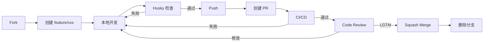

# ✅ Pulse GitHub 标准化工作流程配置完成

## 📋 配置概览

本次配置为 Pulse 项目创建了完整的 GitHub 标准化工作流程，确保高质量代码提交和自动化 CI/CD。

---

## ✅ 已完成的配置

### 1. Git Hooks（自动化检查）

**文件：**
- ✅ `.husky/commit-msg` - 提交信息验证
- ✅ `.husky/pre-commit` - 提交前代码检查
- ✅ `.huskyrc.json` - Husky 配置
- ✅ `commitlint.config.js` - Conventional Commits 配置

**功能：**
- 每次 `git commit` 自动验证提交信息格式
- 自动运行后端 `make lint`
- 自动运行前端 `npm run lint && npm run type-check`
- 不符合规范则阻止提交

### 2. CI/CD Workflows

#### Backend CI（已存在，已优化）

**文件：** `.github/workflows/ci.yml`

**流程：**
1. ✅ Lint（gofmt + go vet）
2. ✅ Test（单元 + 集成 + Race detector）
3. ✅ E2E（MySQL + Redis 真实环境测试）
4. ✅ Docker Build

#### Frontend CI（新增）

**文件：** `.github/workflows/frontend.yml`

**流程：**
1. ✅ ESLint 检查
2. ✅ TypeScript 类型检查
3. ✅ 单元测试 + Coverage
4. ✅ 生产构建验证

### 3. 代码格式化

**文件：**
- ✅ `.editorconfig` - 统一编辑器配置
- ✅ `.prettierrc` - 前端代码格式化配置
- ✅ `.gitignore` - 更新（添加 frontend 和 husky 规则）

**配置：**
- Indent: 2 spaces（前端）/ tabs（Go）
- LF line endings
- UTF-8 encoding
- Trim trailing whitespace

### 4. PR 和 Issue 模板

**PR 模板：** `.github/PULL_REQUEST_TEMPLATE.md`
- 标准化 PR 描述
- 类型选择（feat/fix/docs 等）
- 关联 Issue
- 完整检查清单
- CI/CD、Code Review、Squash Merge 说明

**Issue 模板：** `.github/ISSUE_TEMPLATE/`
- ✅ `bug_report.md` - Bug 报告模板
- ✅ `feature_request.md` - 功能请求模板
- ✅ `config.yml` - Issue 页面配置

### 5. 文档

**已更新/创建：**
- ✅ `CONTRIBUTING.md` - 完全重写，包含完整工作流程
- ✅ `WORKFLOW.md` - 工作流程详细说明
- ✅ `DEVELOPER_GUIDE.md` - 开发者完整指南
- ✅ `CHANGELOG.md` - 变更日志模板
- ✅ `SECURITY.md` - 安全策略
- ✅ `README.md` - 更新开发指南章节

### 6. 辅助工具

**文件：**
- ✅ `setup.sh` - 一键环境配置脚本
- ✅ `worktree.sh` - Git Worktree 管理工具
- ✅ `package.json` - Root 级配置（添加 commitlint、husky 依赖）
- ✅ `frontend/package.json` - 更新（添加 test 脚本、vitest 依赖）
- ✅ `Makefile` - 更新（添加 lint-frontend、type-check、install-* 等命令）

### 7. 其他配置

- ✅ `.github/CODEOWNERS` - 代码所有者配置
- ✅ `.gitmessage.txt` - Git 提交模板

---

## 🎯 核心工作流程



---

## 🚀 快速开始

### 安装依赖

```bash
cd /c/Users/29658/pulse

# 一键配置（推荐）
./setup.sh

# 或手动
npm install
cd frontend && npm install && cd ..
cd backend && go mod download && cd ..
npm run prepare  # 安装 husky hooks
```

### 启动开发

```bash
# 启动 Docker 全栈
make docker-up

# 或分别启动
cd backend && go run cmd/server/main.go  # 后端
cd frontend && npm run dev               # 前端
```

### 创建功能分支

```bash
# 方式 1：标准方式
git checkout develop
git checkout -b feature/user-auth

# 方式 2：使用 worktree（推荐，隔离工作目录）
./worktree.sh create feature/user-auth
cd ../pulse-feature-user-auth
```

### 提交代码

```bash
# 开发完成后...
git add .

# 提交（会自动触发 husky 检查）
git commit -m "feat(auth): add OAuth2 authentication"

# 推送
git push origin feature/user-auth
```

### 创建 PR

1. 访问 GitHub
2. 点击 "Compare & pull request"
3. 填写 PR 模板
4. 提交 PR

### 等待合并

- ✅ CI/CD 自动检查
- 👀 维护者 Code Review
- ✅ LGTM（Looks Good To Me）
- 🔀 Squash Merge
- 🧹 清理分支

---

## 📊 文件清单

### 配置文件（10 个）

| 文件 | 用途 |
|------|------|
| `.husky/commit-msg` | 提交信息验证 hook |
| `.husky/pre-commit` | 提交前检查 hook |
| `.huskyrc.json` | Husky 配置 |
| `commitlint.config.js` | Conventional Commits 规则 |
| `.editorconfig` | 编辑器配置 |
| `.prettierrc` | Prettier 格式化 |
| `.gitignore` | Git 忽略规则 |
| `.gitmessage.txt` | 提交模板 |
| `Makefile` | 构建工具命令 |
| `package.json` | Root 依赖配置 |

### GitHub 配置（7 个）

| 文件 | 用途 |
|------|------|
| `.github/workflows/ci.yml` | 后端 CI/CD |
| `.github/workflows/frontend.yml` | 前端 CI/CD |
| `.github/workflows/release.yml` | 发布流程 |
| `.github/PULL_REQUEST_TEMPLATE.md` | PR 模板 |
| `.github/ISSUE_TEMPLATE/bug_report.md` | Bug 报告模板 |
| `.github/ISSUE_TEMPLATE/feature_request.md` | 功能请求模板 |
| `.github/ISSUE_TEMPLATE/config.yml` | Issue 配置 |
| `.github/CODEOWNERS` | 代码所有者 |

### 文档（7 个）

| 文件 | 用途 |
|------|------|
| `CONTRIBUTING.md` | 贡献指南（已更新） |
| `DEVELOPER_GUIDE.md` | 开发者详细指南（新增） |
| `WORKFLOW.md` | 工作流程说明（新增） |
| `CHANGELOG.md` | 变更日志（新增） |
| `SECURITY.md` | 安全策略（新增） |
| `README.md` | 项目介绍（已更新） |
| `setup.sh` | 环境配置脚本（新增） |
| `worktree.sh` | Worktree 管理工具（新增） |

### 前端配置（1 个）

| 文件 | 更改 |
|------|------|
| `frontend/package.json` | 添加 test 脚本、vitest 依赖 |

---

## 🔑 关键特性

### ✅ 自动化检查

- **本地**：Git hooks 在提交前检查
- **远程**：CI/CD 在 PR 时检查
- **合并前**：Code Review 人工检查

### ✅ 标准化流程

- 统一的提交信息格式
- 标准化的 PR 描述
- 结构化的 Issue 报告

### ✅ 代码质量

- Lint 检查（gofmt + go vet + ESLint）
- 类型检查（TypeScript）
- 自动化测试（单元 + 集成 + E2E）

### ✅ 文档完善

- 完整的贡献指南
- 详细的开发者文档
- 清晰的工作流程说明

---

## 📝 下一步

### 1. 测试配置

```bash
cd /c/Users/29658/pulse

# 安装依赖
npm install

# 安装 husky hooks
npm run prepare

# 测试提交
git add .
git commit -m "test: verify workflow configuration"
```

### 2. 更新 GitHub 仓库配置

在 GitHub 仓库设置中：

1. **启用 GitHub Actions**
   - Settings → Actions → General → Allow all actions

2. **配置分支保护规则**
   - Settings → Branches → Add rule
   - Branch name pattern: `main`, `develop`
   - 启用：
     - ✅ Require a pull request before merging
     - ✅ Require status checks to pass before merging
     - ✅ Require conversation resolution before merging
     - ✅ Do not allow bypassing the above settings

3. **启用 CODEOWNERS**
   - Settings → Code security and analysis → Code Owners
   - 将 `.github/CODEOWNERS` 中的 `@yourusername` 替换为实际用户名

4. **配置 Issue 模板**
   - Settings → Features → Issues → Templates
   - 选择已创建的模板

### 3. 推送到 GitHub

```bash
# 提交所有更改
git add .
git commit -m "chore: add GitHub workflow configuration"
git push origin main
```

### 4. 通知贡献者

更新团队文档，通知所有贡献者：

- Git hooks 现在会自动检查提交
- CI/CD 会在 PR 时运行
- 需要遵循 Conventional Commits
- 使用 PR 模板

---

## 📚 参考文档

- [CONTRIBUTING.md](CONTRIBUTING.md) - 贡献指南
- [WORKFLOW.md](WORKFLOW.md) - 工作流程详细说明
- [DEVELOPER_GUIDE.md](DEVELOPER_GUIDE.md) - 开发者完整指南
- [Conventional Commits](https://www.conventionalcommits.org/)
- [Husky](https://typicode.github.io/husky/)
- [GitHub Actions](https://docs.github.com/en/actions)

---

## 🎉 配置完成

所有标准化工作流程已配置完成！现在你的项目拥有：

- ✅ 完整的 Git hooks 自动化检查
- ✅ 前后端 CI/CD 流程
- ✅ Conventional Commits 提交规范
- ✅ 标准化的 PR 和 Issue 模板
- ✅ 完善的文档和辅助工具

**开始贡献吧！** 🚀

如有问题，请查看 [WORKFLOW.md](WORKFLOW.md) 或 [DEVELOPER_GUIDE.md](DEVELOPER_GUIDE.md)。
